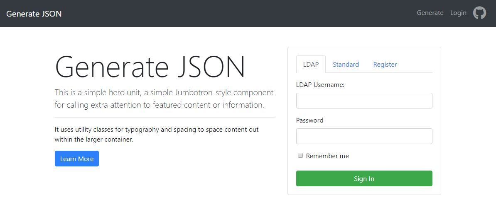

# JSON Config Generator Application

Allowing customers to generate their application config file for Middleware (Tomcat) to integrate with a Chef Cookbook. Built in ReactJS and using the Facebook react boilerplate.
---
## App Screenshots


---


## Getting started

Clone the repo to your local machine
```
git clone git@github.build.ge.com:Digital-CT-APS-WebServices/app-config-json-react.git
```

It will create a directory called **app-config-json** inside the current folder.
Inside that directory, it will have the initial project structure and other application files and install the transitive dependencies:

```
app-config-json
├── README.md
├── node_modules/
├── package.json
├── package-lock.json
├── .gitignore
├── public
│   ├── favicon.ico
│   ├── index.html
│   └── manifest.json
└── src
    ├── App.css
    ├── App.js
    ├── App.test.js
    ├── index.css
    ├── index.js
    ├── logo.svg
    ├── Navigation.css
    ├── Navigation.js
    ├── Navigation.test.js
    └── registerServiceWorker.js
```

### Running locally

Change to your cloned directory `cd app-config-json`

Install the dependencies with yarn or npm
```
npm install

yarn install
```

Start the development server:
```
npm start

yarn start
```

Runs the app in development mode.
Open http://localhost:3000 to view it in the browser.

## Wishlist

- [x] Add GitLab-style login
- [x] Add React Routing
- [ ] Receive final JSON model to fill
- [ ] Implement form to populate JSON
- [ ] Output JSON to a new tab on clicking Submit 
